# Crack WEP Password
## Công cụ
* Aireplay-ng
* Aircrack-ng
* Airodump-ng
* Commview
* Kismet
## Mô hình tấn công

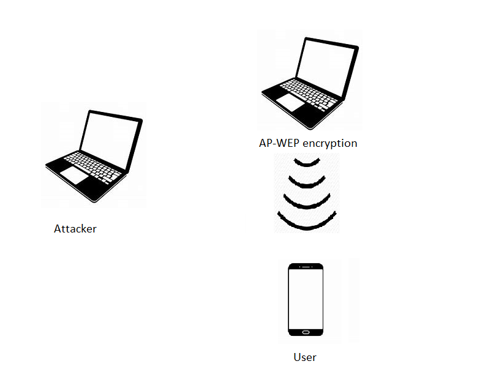

### 1. Attacker
* OS: Kali linux 2018-2 amd64
* Processor: Intel (R) Core (TM) i5-7200U CPU @ 2.50GHz 2.70GHz
* RAM: 8.00GB
* Wireless Card: Intel(R) Dual Band Wireless-AC 3165
* MAC Address: 58:FB:84:91:78:28
### 2. User
* Samsung Galaxy J5 Prime đang được kết nối vào Laptop Access Point
### 3. Laptop Access Point
* OS: Kali linux 2018-2 amd64
* Processor: Intel (R) Core (TM) i3- 6100 CPU @ 2.30GHz 2.30GHz
* RAM: 4.00GB
* Wireless Card: Realtek RTL8723BE 802.11 bgn Wi-Fi Adapter
### 4. WEP Key
Access Point:
* SSID: snowboyiscomin
* BSSID: 94:E9:79:64:49:ED
* Channel: 1
* Security: 40 bit WEP key, open system


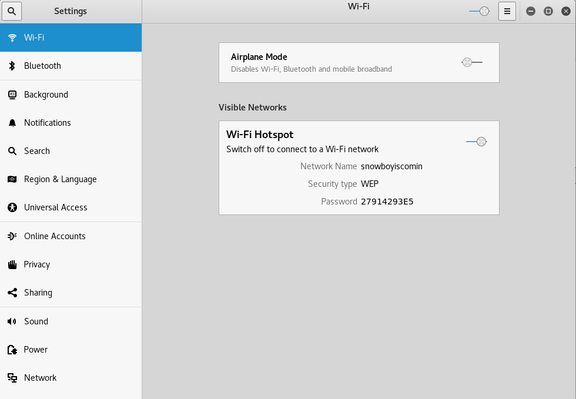

## Solution
Để crack WEP key của AP, cần thu thập 1 lượng các initialization vectors (IVs). Traffic của network thông thường không lưu thông các IVs này 1 cách nhanh chóng. Vì không đủ kiên nhẫn chờ đợi, attacker sử dụng kĩ thuật injection để tăng tốc độ của quá trình. Một trong những cách inject hiệu quả nhất để lấy được số lượng lớn IVs là kĩ thuật ARP request replay attack. Attacker lắng nghe một gói tin ARP trong mạng sau đó retransmit nó lại cho AP, lần lượt, làm cho AP repeat gói tin ARP với IV mới. Cùng một gói tin ARP sẽ được gửi lặp lại liên tục, tuy nhiên mỗi gói tin trả lời từ AP sẽ có một IV mới. Nhờ kĩ thuật này, target AP sẽ phản hồi lại nhanh chóng, cho phép bắt một số lượng lớn các IVs trong thời gian ngắn. Dựa vào số lượng IVs này, attacker có thể tìm ra được WEP key.

> ARP (Address resolution protocol) là một giao thức TCP/IP được dùng để convert một IP address sang một physical address. Một host muốn biết địa chỉ physical của một host khác sẽ broadcast một ARP request trên mạng, host trong mạng có địa chỉ chứa trong ARP request sẽ replies lại physical address của mình.
## Các bước tấn công
Những bước cơ bản:
* Step 1: Bật monitor mode trên wireless interface. 
* Step 2: Bắt đầu airodump-ng trên target AP channel để thu thập các IVs trong các frames
* Step 3: Sử dụng aireplay-ng để fake authentication với AP 
* Step 4: Sử dụng aireplay-ng ở chế độ ARP request replay mode để inject packets 
* Step 5: Sử dụng aircrack-ng để crack WEP key dựa vào các IVs đã thu thập được 
### Step 1 Bật monitor mode trên wireless interface.
Mục đích là đưa wireless card sang monitor mode, lúc này card mạng có thể nghe được tất cả các gói tin trong môi trường mạng không dây đồng thời có thể inject các gói tin.  
Run:
```bash
# airmon-ng start wlan0
# airmon-ng check kill
```

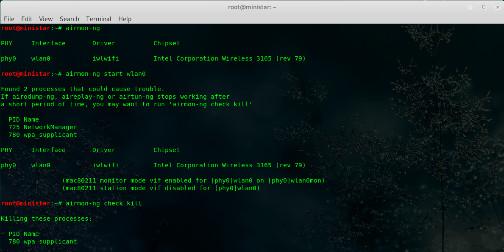

Lúc này interface wireless được đổi tên thành wlan0mon.
###	Step 2 Bật airodump-ng bắt gói tin
Mục đích chính là mở process bắt đầu bắt các IVs được tạo ra từ target AP. 
Đầu tiên, dò quét các mạng có trong khu vực:  
Run:
```bash
# airodump-ng wlan0mon
```

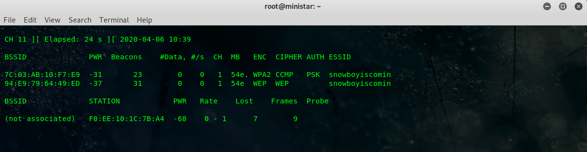

Sử dụng thêm các tùy chọn để lọc các gói tin của target AP và lưu vào files:  
Run:  
```bash
# airodump-ng –bssid <AP MAC> -c <AP channel> -w <file’s name> wlan0mon 
```


Result:

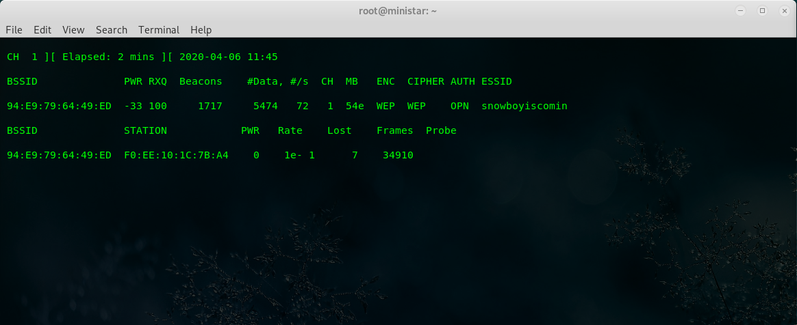

Station **F0:EE:10:1C:7B:A4** là máy user đã kết nối vào AP.  
Các file được tạo ra:

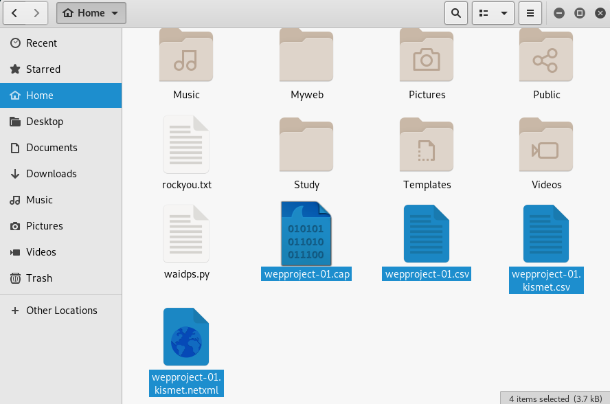

Để tiến trình này xuyên suốt quá trình tấn công để bắt đủ các gói tin chứa IVs.
###	Step 3 Sử dụng aireplay-ng để fake authentication với AP 
AP sẽ chỉ chấp nhận và repeat các gói tin mà địa chỉ gửi MAC đã được “associated”. Vì vậy source MAC address phải được associated. Nếu source MAC address trong gói tin injected không associated thì AP sẽ ignores gói tin đó, gửi lại gói tin de-authentication. Lúc này attacker không nhận được bất kì IVs nào.  
Để associate với AP, sử dụng fake authentication:  
Run:  
```bash
# aireplay-ng -1 <long delay> -o <packet(s) per time> -q <time to send keep alive packet> -a <AP’s MAC> -h <source MAC> wlan0mon
```

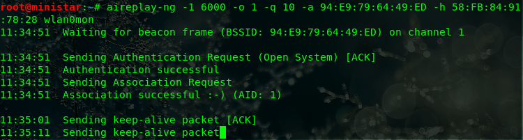

###	Step 4 Sử dụng aireplay-ng ARP request replay mode để inject packets
Mục đích bước này là start aireplay-ng ở mode lắng nghe ARP request sau đó reinject ngược vào mạng:  
Run:  
```bash
# aireplay-ng -3 -b <AP’s MAC> -h <Source MAC> wlan0mon 
```
Bắt đầu lắng nghe, khi tìm được một ARP request, aireplay-ng sẽ lập tức bắt đầu inject nó.

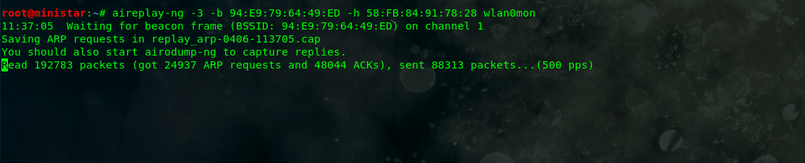


###	Step 5 Sử dụng aircrack-ng để crack WEP key
Run:  
```bash
# aircrack-ng <file .cap>
```  
Kết quả tìm được key khi có đủ IVs (31599 IVs cho key 1 và 22523 IVs cho key 2):

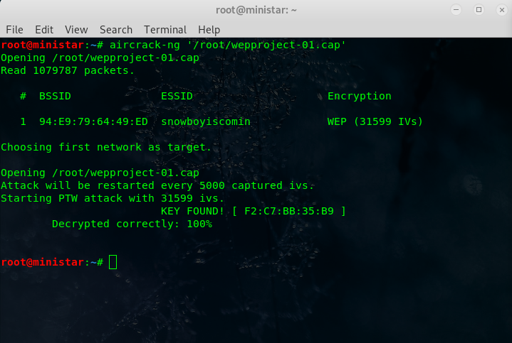

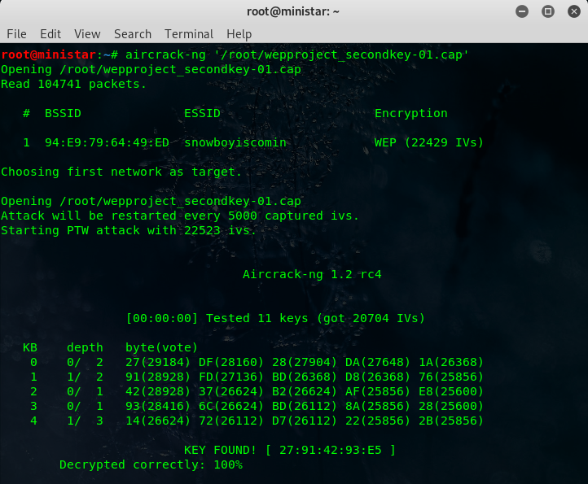

## Kismet và Commview
Hai công cụ này có thể thay thế airmon-ng và airodump-ng trong quá trình tấn công crack WEP password.
### Kismet 
Kismet khởi động sẽ tự động tạo ra 1 file pcapng và lưu lại tất cả những gì mà nó bắt được trên mạng. Đồng thời nó mở một port trên localhost (2501) dành cho kismet UI cho ta dễ sử dụng hơn.

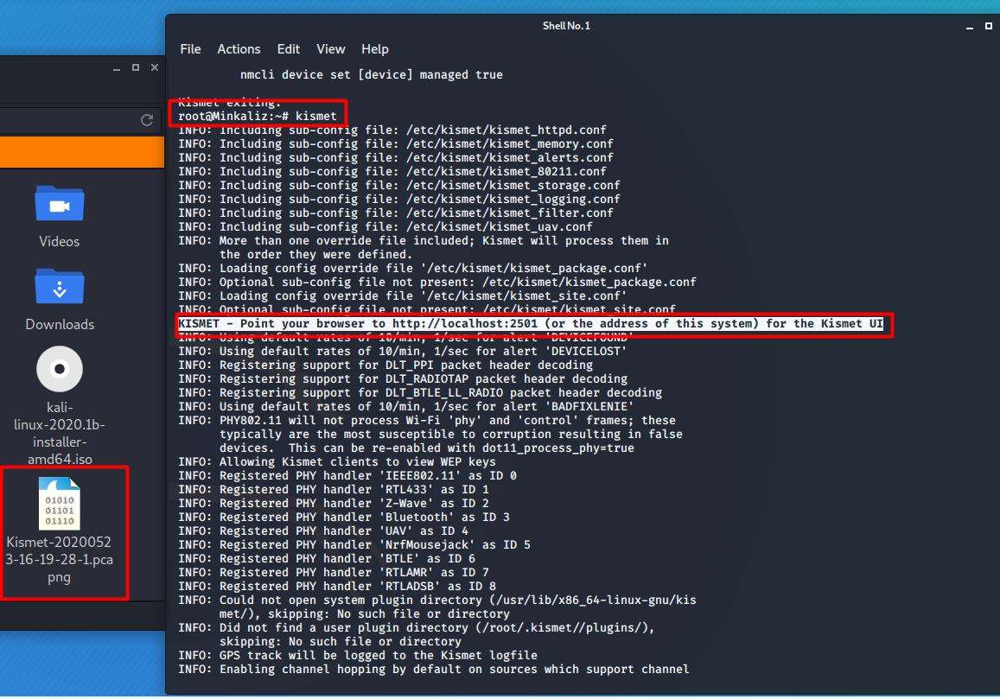

Ta truy cập vào giao diện của kismet và tùy chọn cấu hình chế độ giám sát nhảy qua lại giữa các channel hoặc chỉ giám sát lại 1 channel duy nhất. Giả sử ở đây ta chọn giám sát trên một channel duy nhất.

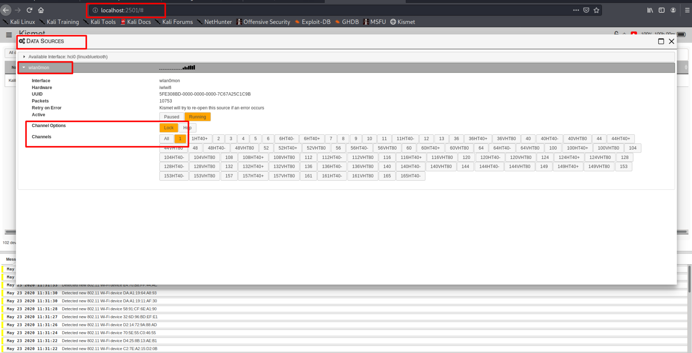

Ta dò quét thấy đối tượng Access Point “Kalilinux” đang sử dụng mã hóa WEP, đây sẽ là đối tượng mà ta muốn tấn công.

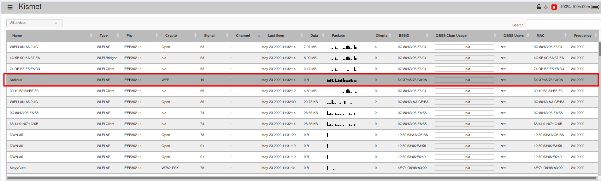

Ta có thể thực hiện tấn công ARP request replay attack hoặc chờ cho đến khi lấy được đủ số IV. Sau đó ta cho dừng kismet lại, lúc này toàn bộ packet bắt được trong quá trình giám sát đều được lưu vào file .pcapng.

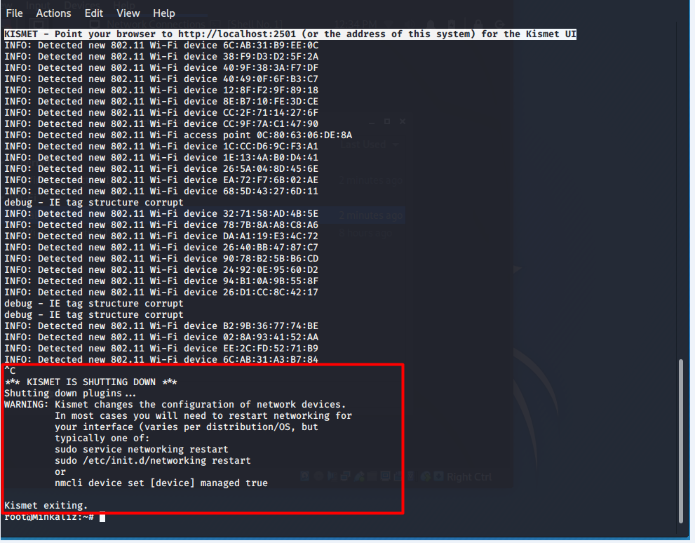

Cuối cùng ta sẽ sử dụng công cụ aireplay-ng để phá mã dựa trên những IV bắt được từ file pcapng này.

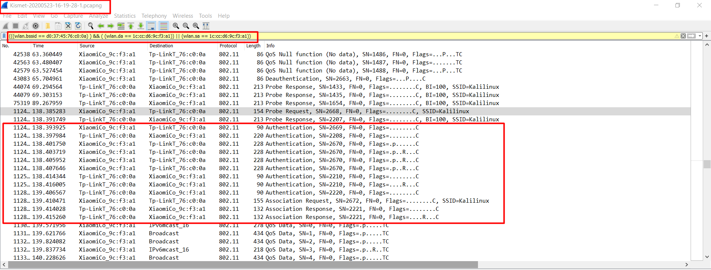

### Commview
Sử dụng tương tự Kismet, Commview cung cấp giao diện, dễ thao tác.  
Chọn scan target AP trên các tiêu chí lọc:

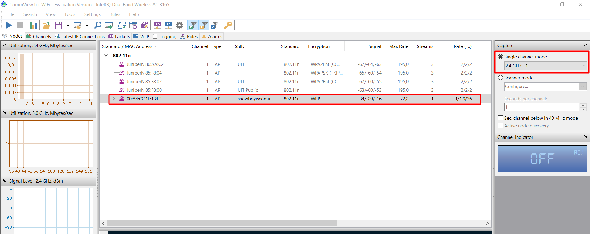

Lọc theo địa chỉ MAC tới và đi khỏi AP nhằm loại bỏ những gói tin dư thừa, không chứa IVs:

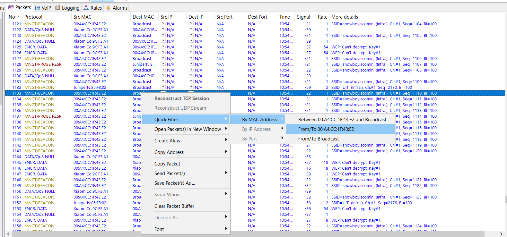

Sau khi lọc, Commview sẽ xuất ra Log Viewer theo điều kiện lọc đến và đi AP (sau đó có thể thực hiện lọc tiếp các gói tin đến và đi khỏi Attacker):
 
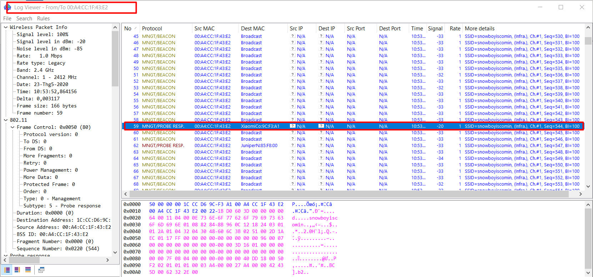

Sau quá trình tấn công thu được file chứa đủ lượng IVs cần thiết có thể export file sang định dạng .pcap để thực hiện những thao tác tiếp theo.

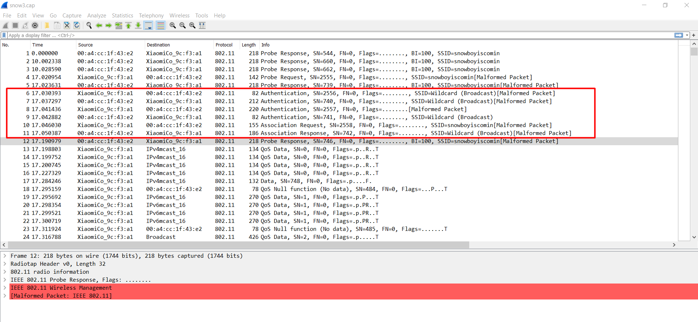

Hai công cụ Commview và Kismet thực hiện vai trò tương tự nhau, tương tự airodump-ng để bắt được các gói tin trao đổi chứa những thông tin cần thiết cho cuộc tấn công là IVs chứa trong gói tin trả về của AP, đóng vai trò quan trọng của cuộc tấn công.  